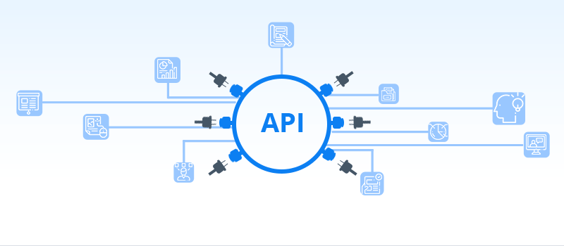

  

# Calindra-bck

 

## About

  This project's only purpose is to respond to the challenge made by Calindra through an interview process. This is an API project that returns the distance in kilometers between two or more given addresses as well as the shortest and the furthest distance among the distances calculated. It uses <a href="https://developers.google.com/maps/documentation/geocoding/start">Google's geocoding API</a> to convert addresses (like a street address) into geographic coordinates (like latitude and longitude). It won't have a browser interface. The link to direct requests is down below in the <a href="#deploy">Deploy</a> session.

  

    <a href="#features">Features</a> •
    <a href="#stack">Stack</a> •
    <a href="#deploy">Deploy</a> •
    <a href="#authors">Authors</a>

 

### Features
- Routes:
- [x] API route to handle requests and return the desired answer  
- Controllers:
- [x] Address layer to handle the addresses passed on the request and return their geolocation 
- [x] Distance layer to handle the request of the distances between each two addresses and to solve which distance is the closest and which is the furthest  
- Auxiliar Functions:
- [x] Function to calculate the Euclidean distances between each two addresses. 
- [x] Function to solve the addresses geolocation with Google API.

  

### Stack
Languages: 

  
  
  

 

The following tools and frameworks were used in the construction of the project: 

  
  
  
  
  
  
  
  
  

 

Version Control: 

  
  

  

### Deploy

The API is available on VercelApp through the following link: [Calindra-bck](https://calindra-bck-qpgsg53qw-klaussvp.vercel.app/)

  
## Contributors
<table>
  <tr>
    <td align="center" style="margin-right: 20px;"><a href="https://github.com/vercel"> <b>Vercel</b></a> 
  </tr>
  <tr>
    <td align="center" style="margin-right: 20px;"><a href="https://github.com/googleapis"> <b>GoogleAPIs</b></a> 
  </tr>
</table>

  

### Authors
---
  |   Klauss Correa | 👋 Get in Touch!     |
  |-----------|-----------|
